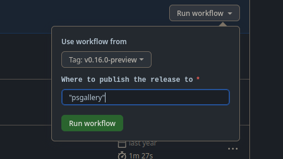

# Performing a release

## Staging the release

To perform a new release of the module it must first be staged using the `stage-release` GitHub action.
You'll be prompted to choose a [release type](#choosing-a-release-type) and a branch/tag to create the release from.  
If the release is staged from a branch that isn't `main` then the release will be created as a [pre-release](#creating-a-pre-release).  

This workflow will update the [changelog](../CHANGELOG.md) automatically with all the changes since the last release so it is no longer necessary to manually update this before performing a release.  
The [module documentation page](./Brownserve.PSTools.md) will also get updated to ensure the `help version` matches the version of the module being released.  
As we don't allow direct pushes to `main` a pull request will then be created which will require review and approval before the release can be published.  
This ensures that all releases are reviewed by at least one person before being published.  

If you need to make any changes/adjustments then you can do so on the branch that was created by the workflow.

## Publishing the release

Once the release has been staged, you can publish it by running the `publish-release` GitHub action.
This workflow will build and test the module, then all being will, will publish the module to the endpoints specified in the `publish_to` input.

## Choosing a release type

The release type you choose will be used to determine the version number of the new release.  
Release type's can be one of the following:

* `major` - A major release, this will increment the major version number, and reset the minor and patch version numbers to 0.
* `minor` - A minor release, this will increment the minor version number, and reset the patch version number to 0.
* `patch` - A patch release, this will increment the patch version number.

### Major releases

Major releases are used for releases that contain breaking/non-backwards compatible changes.  
Some examples of breaking changes would include:

* Substantially changing the behaviour of a cmdlet.
* Changing the output of a cmdlet such that it is no longer compatible with previous versions.
* Removing a previously deprecated cmdlet.
* Removing a previously deprecated input/output.
* Renaming a cmdlet/parameter/return value without first having followed the deprecation process.
* Fundamentally changing the return object of a cmdlet.

### Minor releases

Minor releases are used for releases that contain new features or backwards compatible changes.
Some examples of backwards compatible changes might include:

* Adding a new cmdlet.
* Adding a new return value to a cmdlet without changing the existing return values.
* Adding a new parameter to a cmdlet without changing the existing ones.
* Renaming a parameter while providing an alias for the old name.
* Deprecating a cmdlet without removing it.
* Renaming a cmdlet while providing a deprecated copy with the old name.

### Patch releases

Patch releases are used for releases that contain bug fixes or other minor changes.
Some examples of patch changes might include:

* Fixing a bug in a cmdlet while not changing the behaviour.
* Fixing typos.
* Documentation changes.
* CI/CD/Build changes.
* Style/formatting changes that do not affect the behaviour of the cmdlet.

## Creating a Pre-release

Sometimes you may want to create a pre-release when you're moving between major versions, rolling out a specific bug fix or introducing new features/changes that require some broader testing before being released to the general public.  

To perform a pre-release first create a new branch from `main` and give it a sensible name as this will be used in the version number of the pre-release (e.g. `rc1`, `preview`, `myFix` etc)  
Then simply run the `stage-release` GitHub action, choose the release type as normal and make sure you select the branch you created as the branch to build from.  
The build will detect that the release is being staged from a branch and will automatically create a pre-release. (e.g. `v2.0.0-rc1`)  
Once the release has been staged you can publish it as normal.

## Re-publishing a previous release

Most of the repositories we publish to will not allow you to re-publish a release with the same version number (for good reason!) so we actively check-for and prevent this from happening in the builds.  

If there's an issue with a release that requires you to re-publish it, you'll need to increment the version number of the release and perform a new release. (If the issue is serious enough you should also consider pulling the faulty release from the endpoints you've previously published to.)  

The only exception to this is when either adding a new release endpoint or when a push to an existing endpoint fails (for example if the repository is down at the time of publishing, or an API key is expired etc).
In these cases you can run the `publish-release` GitHub action again _making sure to select the branch tag_ of the version you wish to re-publish. You should then set the `publish_to` input to only include the endpoints that don't already have the release published to them.

For example to republish version `0.16.0-preview` to the PowerShell Gallery you would set the `publish_to` input to `PSGallery` and the `branch_tag` input to `0.16.0-preview`.



## Custom NuGet Feeds

Sometimes it can be useful to publish the module to a custom NuGet feed, for example if you're testing a very early version of the module or for our proxy feed.
To publish to a custom NuGet feed you'll need to pass the `CustomNugetFeeds` parameter to the `Release` task, this should be an array of objects with the following properties:

* `Name` - The name of the feed (can be anything you like).
* `Url` - The URL of the feed.
* `Credential` a `PSCredential` object containing the username and password (or PAT) for the feed.
* `PublishAs` whether to publish the module as a `ModulePackage` or a `NugetPackage` (see [ModulePackage vs NugetPackage](#modulepackage-vs-nugetpackage) for more information).

Currently our GitHub Actions workflow does not support publishing to custom NuGet feeds so you'll need to run the `Release` task locally to publish to a private feed. Given that private feeds often require authentication it's probably best to define the feeds in the `release.yaml` workflow file using secrets if we need to publish to them regularly in the future.

### Example

The below example demonstrates publishing to two different custom NuGet feeds, one using a `PSCredential` object and the other using `Get-Credential` to prompt for the credentials.

```powershell
$Username = 'MyUsername'
$Password = 'MyPassword' | ConvertTo-SecureString -AsPlainText -Force
$Credential = New-Object System.Management.Automation.PSCredential ($Username, $Password)

$customNugetFeeds = @(
    @{
        Name = 'MyCustomFeed'
        Url = 'https://pkgs.dev.azure.com/MyOrg/MyFeed/_packaging/NugetFeed/nuget/v2'
        Credential = $Credential
        PublishAs = 'ModulePackage'
    },
    @{
        Name = 'MyOtherCustomFeed'
        Url = 'https://pkgs.dev.azure.com/MyOrg/MyOtherFeed/_packaging/NugetFeed/nuget/v3/index.json'
        Credential = (Get-Credential)
        PublishAs = 'NugetPackage'
    }
)
```

### ModulePackage vs NugetPackage

By default NuGet packages store the module in a subdirectory called `tools` so when extracted it may look something like this:

```plaintext
Brownserve.PSTools
├── tools
│   ├── Brownserve.PSTools.psd1
│   ├── Brownserve.PSTools.psm1
```

This is fine for most cases, however if you want the module to be installable by the `Install-Module` cmdlet then the module needs to be at the root of the package. This would look something like this:

```plaintext
Brownserve.PSTools
├── Brownserve.PSTools.psd1
├── Brownserve.PSTools.psm1
```

To achieve this you can set the `PublishAs` property to `ModulePackage` which will publish the module as a `ModulePackage` instead of a standard `NugetPackage`.

## Running release process locally

It's entirely possible to run through the release process locally if you need to.  
See the section on [building locally](BUILDING.md#building-locally) for information on how to get the required dependencies installed.  
Once you're ready to release you can run the `StageRelease`, `DryRun` and `Release` tasks from the `.build/build.ps1` script.

You'll need to provide the following parameters to the `StageRelease` task:

* `ReleaseType` - The type of release to perform, this can be one of `Major`, `Minor` or `Patch`.
* `GitHubStageReleaseToken` - A GitHub personal access token with enough permissions to read/write pull requests and read issues.

You'll need to provide the following parameters to the `Release` and `DryRun` tasks:

* `PublishTo` - A comma separated list of endpoints to publish the release to, this can be one or more of `PSGallery`, `GitHub`, `CustomNugetFeeds` and `NuGet`
* `GitHubReleaseToken` - A GitHub personal access token with enough permissions to read/write releases (if publishing to GitHub).
* `NugetFeedApiKey` - An API key for the NuGet feed to publish to (if publishing to NuGet).
* `PSGalleryApiKey` - An API key for the PowerShell Gallery to publish to (if publishing to PSGallery).
* `CustomNugetFeeds` - A list of custom NuGet feeds to publish to (if required) see the [Custom NuGet Feeds](#custom-nuget-feeds) section for more information.
